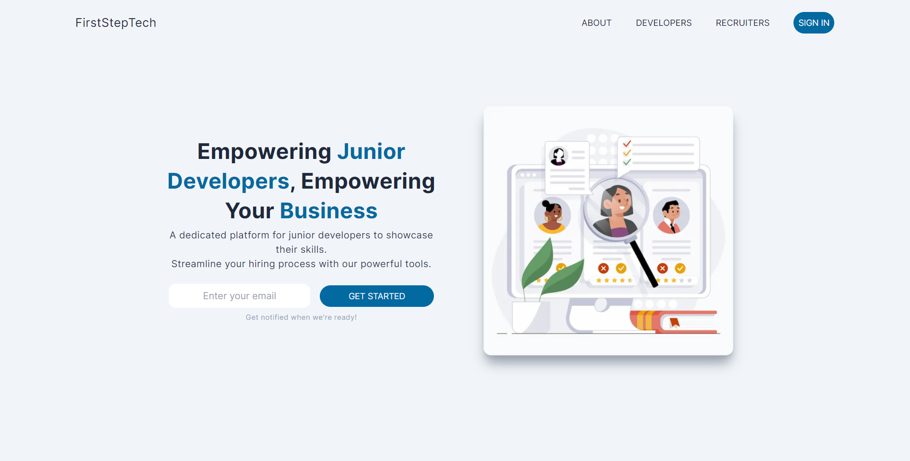
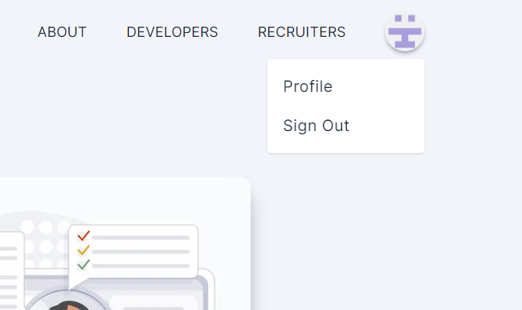
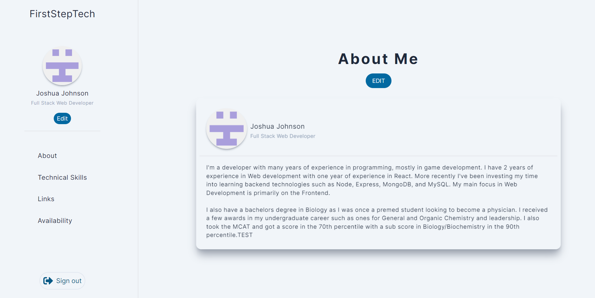
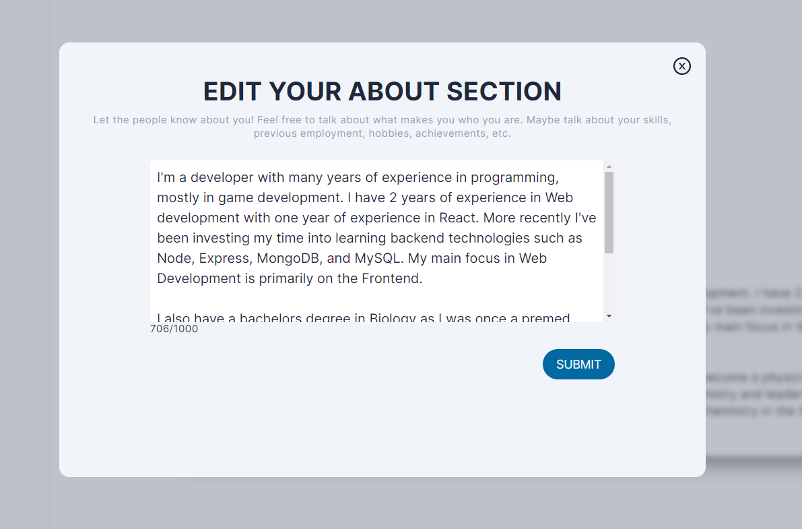

This is a [Next.js](https://nextjs.org/) project bootstrapped with [`create-next-app`](https://github.com/vercel/next.js/tree/canary/packages/create-next-app).

## What is FirstStepTech

This app mockup was made as a proof of concept of a platform used by junior developers and recruiters. It's purpose was to make finding junior developers more accessible to recruiters and help alleviate some of the problems that many people find when job searching.

One of the biggest problems that junior devs face when searching for jobs is when the listings are set to "entry/junior" level, yet ask for many years of experience. This app is the precursor to a solution I wish to implement.

After using this project as a learning opportunity, I feel ready to dive into the real project. There was no planning, so the demo architecture isn't ideal. Below is how the demo ended up.

